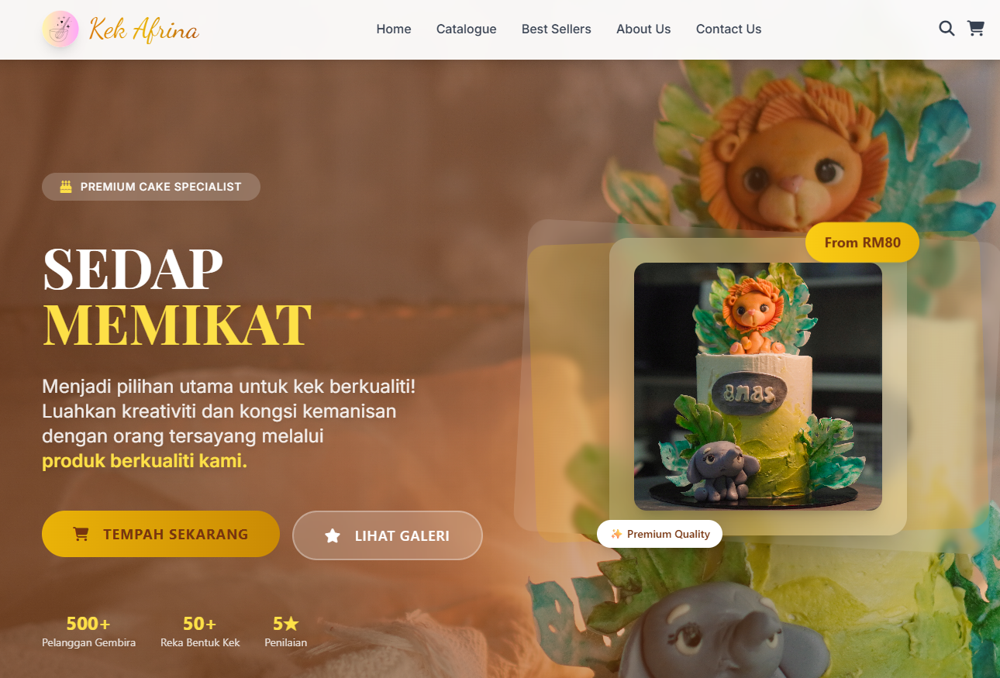

# AkaWeb 🍰

AkaWeb is a Tailwind-first, responsive bakery storefront template with a product catalogue, checkout flow, and rich animations—built in vanilla HTML/CSS/JS with AOS and Font Awesome.

Build for a multimedia project.


## ✨ Highlights

- 🌀 Tailwind-first styling with a custom gold/brown palette, extended fonts, and animations
- 🧁 Polished hero, “Top Sellers” grid, services, and footer sections
- 🛒 Catalogue and checkout flow (static prototype)
- 🧰 Framework-free stack (HTML/CSS/JS) + AOS and Font Awesome icons
- 🚀 One-click deploy to any static host (GitHub Pages, Netlify, Vercel, etc.)
- 🖋️ Optional “RuumiDev” watermark component for subtle branding

## 🧩 Project structure

- [index.html](https://github.com/RuumiDev/AkaWeb/blob/main/index.html) — Landing page with animated hero and sections
- [catalogue.html](https://github.com/RuumiDev/AkaWeb/blob/main/catalogue.html) — Product listing
- [checkout.html](https://github.com/RuumiDev/AkaWeb/blob/main/checkout.html) — Checkout flow (client-side prototype)
- [about.html](https://github.com/RuumiDev/AkaWeb/blob/main/about.html) — About page
- [contact.html](https://github.com/RuumiDev/AkaWeb/blob/main/contact.html) — Contact page
- [js/](https://github.com/RuumiDev/AkaWeb/tree/main/js) — Client-side scripts (e.g., `main.js`)
- [src/](https://github.com/RuumiDev/AkaWeb/tree/main/src) — Styles and assets (e.g., `style.css`)
- [img/](https://github.com/RuumiDev/AkaWeb/tree/main/img) — Images and media
- [data/](https://github.com/RuumiDev/AkaWeb/tree/main/data) — Static data (if used)
- [utils/](https://github.com/RuumiDev/AkaWeb/tree/main/utils) — Utilities (if used)

Note: Tailwind is loaded via CDN for rapid iteration.

## 🧱 Tech stack

- 🎨 Tailwind CSS (via CDN) with extended theme (Playfair/Inter/Dancing Script, gold/brown palette, custom keyframes)
- 🧩 Font Awesome icons
- 🎞️ AOS (Animate On Scroll) for entrance animations
- ⚡ Vanilla JavaScript

## 🚀 Quick start

Open directly in your browser:
1. Clone or download this repository.
2. Open `index.html`.

Serve locally (recommended for consistent routing/assets):

- Python 3
  ```bash
  python3 -m http.server 8080
  ```
  Visit http://localhost:8080

- Node (serve)
  ```bash
  npx serve .
  ```
  Follow the printed URL (e.g., http://localhost:3000)

## 🛠️ Customization

- Pages: Edit `index.html`, `catalogue.html`, `checkout.html`, `about.html`, `contact.html`.
- Styles: Extend or override in [`src/style.css`](https://github.com/RuumiDev/AkaWeb/blob/main/src/style.css). Tailwind is heavily used inline.
- Scripts: Adjust behavior in [`js/main.js`](https://github.com/RuumiDev/AkaWeb/blob/main/js/main.js).
- Assets: Add media to [`img/`](https://github.com/RuumiDev/AkaWeb/tree/main/img). 
- Data: Store static JSON (e.g., products) in [`data/`](https://github.com/RuumiDev/AkaWeb/tree/main/data) and load via JS if needed.

## 🖋️ Optional “RuumiDev” watermark

Add a tasteful, clickable watermark badge to any page (e.g., `index.html`) right before `</body>`:

```html
<!-- RuumiDev watermark (subtle, non-intrusive) -->
<a href="https://github.com/RuumiDev"
   class="fixed bottom-4 right-4 z-[60] pointer-events-auto select-none opacity-80 hover:opacity-100 transition"
   aria-label="Built by RuumiDev">
  <span class="px-3 py-1 rounded-full text-xs font-semibold bg-amber-100/90 text-amber-800 shadow-lg border border-amber-200/80">
    © RuumiDev
  </span>
</a>
```

Prefer a faint page-wide watermark? Add this to `src/style.css` and apply `class="ruumidev-watermark"` on `<body>`:

```css
.ruumidev-watermark::after {
  content: "RuumiDev";
  position: fixed;
  inset: 0;
  pointer-events: none;
  color: rgba(0,0,0,0.06);
  font-family: ui-sans-serif, system-ui, -apple-system, Segoe UI, Roboto, Inter, "Helvetica Neue", Arial, "Noto Sans", "Apple Color Emoji", "Segoe UI Emoji";
  font-size: clamp(3rem, 8vw, 10rem);
  font-weight: 700;
  transform: rotate(-18deg);
  display: grid;
  place-items: center;
  text-transform: uppercase;
  z-index: 0;
}
```

Tip: Keep `z-index` lower than your navbar/hero overlays.

## 🧪 Visuals





## 🌍 Deployment

- GitHub Pages
  1. Push to `main`.
  2. In Settings ➜ Pages, choose “Deploy from a branch” and select `main` (root).
  3. Wait for Pages to build and go live.

- Other static hosts: drag-and-deploy the repo root to Netlify, Vercel, Cloudflare Pages, or S3/CloudFront.

## ♿ Accessibility & SEO

- Use semantic headings and aria labels for icons.
- Ensure contrast meets WCAG AA, and focus states are visible.
- Add meaningful `<title>` and `<meta name="description">` on each page.
- Provide descriptive alt text for images.

## 🗺️ Roadmap ideas

- 🔍 Product search and filters on `catalogue.html`
- 💾 Cart persistence with `localStorage`
- 🌐 i18n support (EN/MS toggles)
- 🌗 Dark mode with Tailwind’s `dark` variant
- ✅ Form validation and integrations on `contact.html`
- 🧪 Lightweight testing for critical UI logic

## 🙌 Credits

- Icons: Font Awesome
- Fonts: Google Fonts (Playfair Display, Inter, Dancing Script)
- Demo images: Unsplash placeholders (replace with your originals)

## 👤 Author

Built with ❤️ by [RuumiDev](https://github.com/RuumiDev)

## 📝 License

No license specified yet. 
